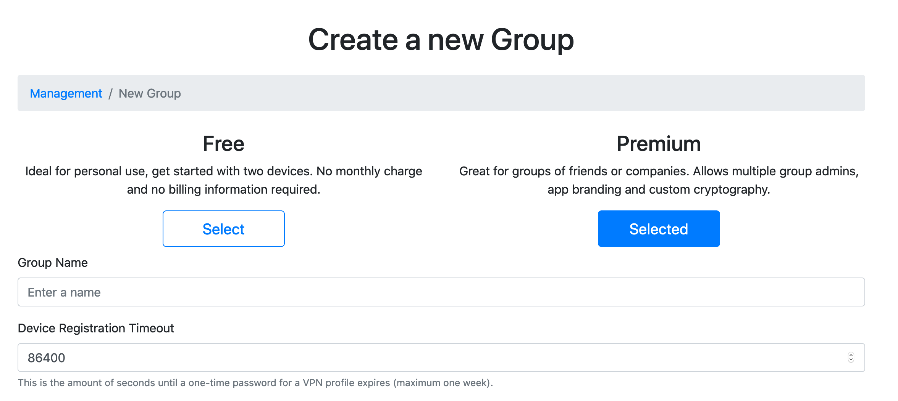
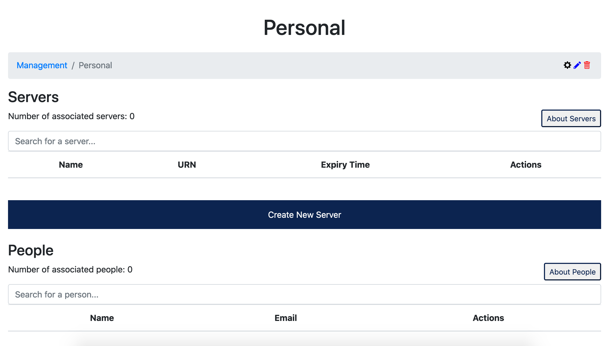
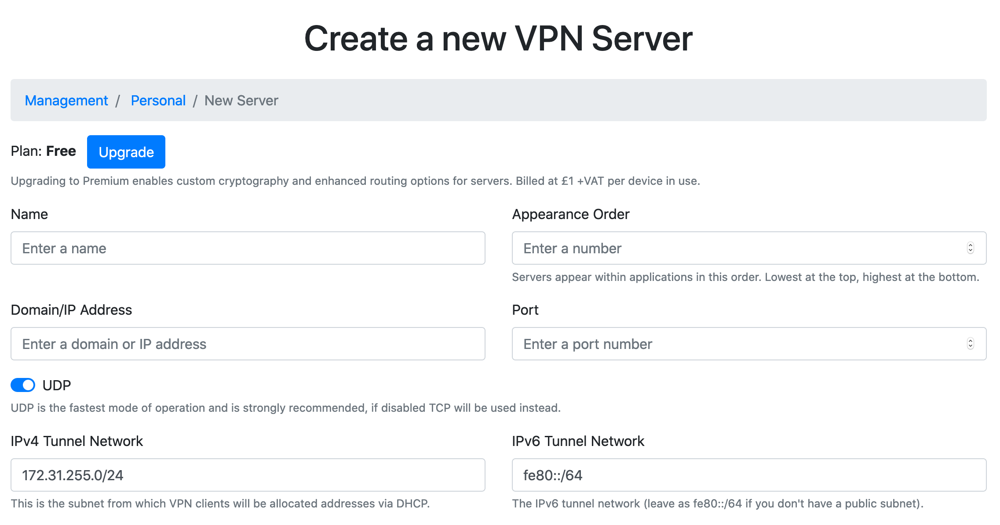
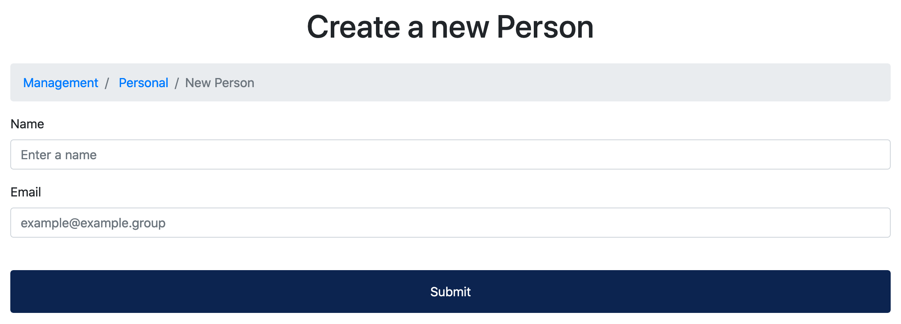
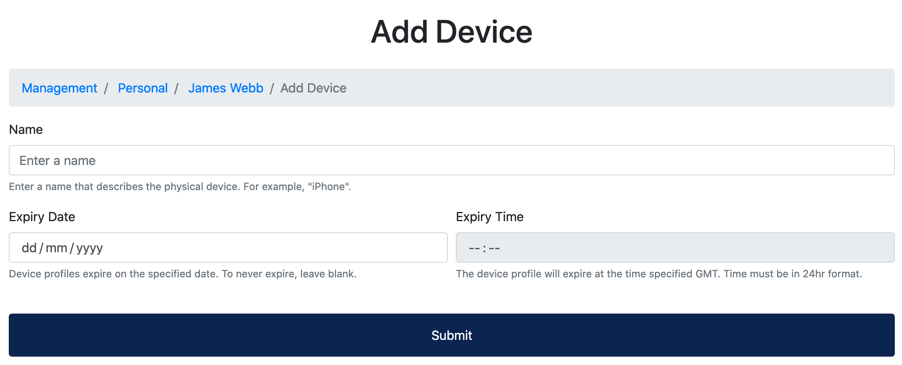

# Intro

### Siapa Ultra Horizon?

Ultra Horizon didirikan pada tahun 2016 oleh dua mahasiswa ilmu komputer yang berspesialisasi dalam jaringan dan kriptografi di **University of Bristol**. Misi mereka adalah mengembangkan sistem jaringan pribadi virtual (<abbr title="Virtual Private Network">VPN</abbr>) yang mampu menyediakan:

- Performa yang tidak tertandingi.
- Menghindari DPI yang kompleks.
- Tingkat keamanan yang tinggi.
- Penggunaan yang mudah.

Produk VPN pertama Ultra Horizon yang diluncurkan dengan kapabilitas ini adalah UH Net pada tahun 2017. Ini adalah aplikasi konsumen yang memungkinkan siapa pun untuk mendapatkan kapabilitas ini melalui layanan berlangganan. Aplikasi ini akhirnya berubah menjadi platform VPN perusahaan, UH Enterprise, yang dijual hari ini dan berisi semua fitur asli yang ditemukan di UH Net, tetapi dengan panel manajemen perusahaan dan fitur branding kustom.

### Infrastruktur Development

Sejak awal perusahaan, Ultra Horizon juga telah banyak berkembang menjadi infrastruktur jaringan melalui pembuatan dan penyebaran perangkat Gamma yang awalnya dirancang untuk sistem VPN. Ultra Horizon sekarang menawarkan solusi untuk jaringan area luas (WAN) dan jaringan area lokal (LAN). Solusi berbasis WAN UH terutama digerakkan oleh serangkaian kontak yang luas dalam jaringan di seluruh dunia dan solusi berbasis LAN kami digerakkan oleh infrastruktur switching tingkat inti / agregasi tingkat tinggi.

### Kelebihan UH VPN

- Manajemen yang Terpusat.
- Easy Deployment.
- Branding Kustom.
- Kecepatan Maksimal.
- Keamanan tingkat tinggi.

# Instalasi UH VPN

### Persiapan

- **OS:** Ubuntu 18.04
- **RAM:** minimal 100MB (1GB)
- **Network:** Mesin dapat diakses baik dan memiliki alamat IP publik, nama host atau DNS dinamis.

### Persyaratan Wajib

1. Alamat IP ini perlu merujuk langsung ke mesin Ubuntu dan bukan pada router atau gateway perantara.

2. Pastikan bahwa port `UDP 443` dan `TCP 2802` terbuka pada instance Ubuntu Anda jika menggunakan firewall. Tutorial ini akan mengatur klien UH VPN untuk terhubung melalui `UDP 443` sehingga port ini harus terbuka. Pembaruan konfigurasi server push melalui `TCP 2802` oleh UH VPN API sehingga port ini juga harus terbuka.

3. Pastikan koneksi SSH atau akses konsol ke mesin tersedia.

### Buat Server di Situs Web UH VPN

Situs web UH VPN adalah pusat perintah dan kontrol untuk deploy VPN. Semua pengaturan VPN dikelola melalui web interface tersebut. Langkah pertama *(jika Anda belum melakukannya)* adalah membuat akun. Kemudian setelah masuk, klik tab **"Management"** dan kemudian tekan tombol **"Create New Group"**. Lalu akan tampil seperti:



Jika Anda hanya menggunakan UH VPN untuk satu perangkat, silakan dan klik tombol **"FREE"**. Namun, jika Anda ingin akses ke lebih banyak fitur seperti branding aplikasi khusus, perangkat tidak terbatas, dan opsi VPN lanjutan, maka pilih paket premium. Rincian opsi dapat dilihat pada halaman Membuat Grup dokumen. Paket premium ditagih setiap bulan dengan tarif £1 per perangkat.

Pilih nama yang sesuai untuk grup contoh dengan nama **"Pribadi"** dan kemudian biarkan batas waktu ditetapkan pada 86400. Kemudian tekan tombol **"Submit"** dan grup akan dibuat.

Klik pada nama grup yang baru saja dibuat dan akan tampil seperti ini:



Langkah pertama adalah membuat server UH VPN, klik tombol **"Create New Server"** dan akan tampil seperti ini:



Masukkan parameter berikut:

- **Name** : UDP
- **Appearance Order** : 0
- **Domain/IP Address** : IPv4 Address noted from the Ubuntu machine earlier
- **Port** : 443
- **UDP** : Enabled
- **IPv4 Tunnel Network** : 172.31.255.0/24
- **IPv6 Tunnel Network** : fe80::/64
- **DNS Servers** : 1.1.1.1, 1.0.0.1
- **Add Forwarding Rule** : Enabled
- **Add NAT Rule** : Enabled

Tekan **SUBMIT** dan server kemudian akan dibuat.

> Deskripsi lengkap dari semua parameter dapat ditemukan di halaman [dokumen pembuatan server](https://docs.uh-vpn.com/en/latest/website/servers/index.html).

Setelah dibuat, klik ikon  untuk mendapatkan token UH VPN API untuk server. Copy dan paste api tersebut ke tempat yang aman karena akan digunakan nanti.

### Konfigurasi Server Ubuntu

Sekarang saatnya masuk ke Server Ubuntu menggunakan SSH.

Langkah pertama adalah menginstal dependensi yang diperlukan:

```bash
sudo apt update
sudo apt install net-tools software-properties-common
```

Sekarang kita tambahkan Ultra Horizon package ke dalam sistem.

```bash
sudo add-apt-repository ppa:ultrahorizon/ppa
```

Prompt akan menampilkan informasi tentang repositori, sistem akan menerima dan mengunduh informasi paket dari arsip yang baru ditambahkan lalu silahkan perbarui sistem:

```bash
sudo apt update
```

Setelah pembaruan selesai, aplikasi UH VPN Server sekarang dapat diunduh melalui manajer paket.

```bash
sudo apt install -y uh-vpn-server
```

Setelah instalasi silahkan Anda untuk mengecek service UH VPN apakah berjalan:

```bash
sudo systemctl status uh-vpn-server
atau
sudo service uh-vpn-server status
```

```terminal
● uh-vpn-server.service - UH VPN Server
   Loaded: loaded (/lib/systemd/system/uh-vpn-server.service; enabled; vendor preset: enabled)
   Active: active (running) since Thu 2020-05-28 12:31:30 UTC; 4h 26min ago
```

Lalu pastikan UH VPN dapat berjalan lagi saat server di restart:

```bash
sudo systemctl enable uh-vpn-server
```

Selanjutnya buat file untuk meletakan token yang telah Anda simpan tadi ke sini `/etc/uh-vpn-server/tokens` buat filenya dengan perintah:

<div class="filename">Membuat file token</div>

```bash
sudo vim /etc/uh-vpn-server/tokens
```

```terminal
# UH VPN Server Token Store
# Paste all tokens here and separate multiple tokens by a newline

0d44096ec96e89f...
```
Dalam contoh ini, token (`0d44096ec96...`) telah ditambahkan ke dalam file. Selanjutnya simpan lalu keluar. <kbd>esc</kbd> ➡️ `:wq!` ➡️ <kbd>ENTER</kbd>.

Server sekarang sudah dikonfigurasi dan siap untuk menerima koneksi VPN yang masuk!

### Instalasi Client Apps

Ini adalah langkah terakhir dalam proses pengaturan. Login terlebih dahulu ke situs website UH VPN dan navigasikan ke grup yang Anda buat sebelumnya. Sekarang saatnya membuat pengguna baru yang berwenang untuk mengakses server VPN yang baru saja Anda buat. Klik tombol **"Create New Person"** dan contoh tampilan halaman seperti ini:



Masukkan nama dan alamat email Anda, lalu tekan **Submit** dan pengguna tersebut akan dibuat.

Selanjutnya saatnya untuk mengaitkan perangkat dengan pengguna yang baru saja dibuat. Untuk melakukannya, klik nama orang tersebut dan kemudian tekan tombol **"Add new device"** dan akan tampil halaman seperti ini:



Masukkan parameter berikut:

- **Nama:** Nama untuk perangkat. Misalnya. Android.
- **Tanggal Kedaluwarsa:** Biarkan tidak terisi kecuali Anda ingin menentukan tanggal untuk pencabutan perangkat.
- **Waktu Kedaluwarsa:** Biarkan tidak terisi kecuali Anda ingin menentukan waktu untuk pencabutan perangkat.

Tekan **Submit** dan perangkat kemudian akan dibuat. Anda kemudian akan menerima email dengan kode akses satu kali (OTP). Unduh aplikasi UH VPN untuk platform Anda dan masukkan kode OTP untuk mengunduh profil. Kemudian Anda dapat terhubung dan menikmati koneksi VPN pribadi yang cepat, aman dan pribadi!

### Aplikasi Client

[](https://apps.apple.com/us/app/uh-vpn/id1513474367?ls=1) [](https://apps.apple.com/us/app/uh-vpn/id1513474367?ls=1) [](https://play.google.com/store/apps/details?id=com.uh_vpn.client.android)