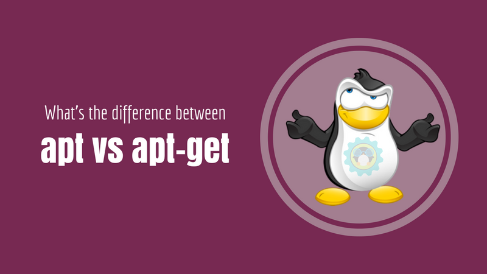
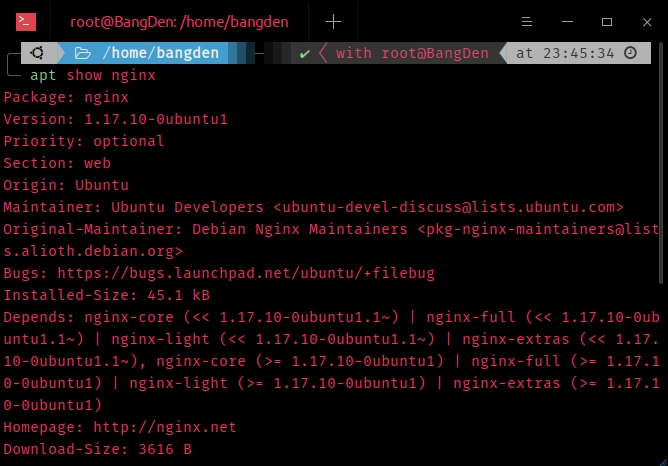
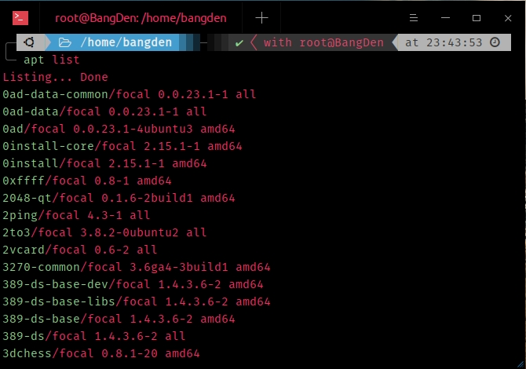

Apakah Anda sudah tahu mengenai perintah apt-get dan apt di berbagai distro linux? Apa sih perbedaan antara apt-get dan apt? Mari kita ulas.



### apt-get 👨‍🏫

`apt-get` merupakan singkatan dari _software_ bernama **APT** yaitu _Advanced Package Tool_ yang memiliki fungsi untuk dapat mengatur sebuah paket paket _software_ yang ada di linux, cotohnya seperti pemasangan _software_, menghapus _software_, dan meng-upgrade kernel dan berbagai lainnya.

Yang perlu Anda ketahui adalah `apt-get` dan `apt` merupakan dua hal yang berbeda. Meski ada kesamaan dari keduannya yaitu:

```terminal
# apt-get:

$ apt-get install nginx

# apt:

$ apt install nginx
```

Perintah `apt` merupakan perintah yang terbaru, sedangkan untuk perintah `apt-get` merupakan perintah yang sudah lama. `apt` sendiri merupakan perintah yang sama saja seperti `apt-get`. Namun `apt` dibuat ulang untuk memperbarui versi dari `apt-get`.

`apt` mengesampingkan fitur-fitur yang tidak diperlukan yang sebelumnya ada di `apt-get` dan `apt` sendiri sangat terstruktur.

Dalam penjelasan yang ada di atas dapat disimpulkan bahwa `apt` merupakan sebuah perintah yang baru dirilis untuk menggantikan perintah `apt-get` dan perintah biasa digunakan banyak orang mulai `apt-get` & `apt-cache`.

---

### Apakah masih perlu menggunakan apt-get? 🤔

Lalu, apakah perintah `apt-get` masih perlu untuk digunakan? Sampai saat ini, `apt-get` masih beredar dan dirilis di distro linux utama, contohnya Debian. Namun, dalam _low operations_ kita masih dapat menggunakannya untuk tujuan, misalnya pembuatan _script_, dll. Kemungkinan `apt-get` sendiri dana _low operations_ masih memiliki banyak fitur dan fungsi ketimbang `apt` sendiri.

---

### Lalu mana yang harus digunakan? 🙄

Sampai saat ini hal yang sangat disarankan dari distro linux ialah menggunakan perintah `apt`. Karena pada dasarnya perintah `apt` digunakan untuk menggantikan `apt-get` dan ditambah lagi `apt` memiliki opsi yang lebih sedikit dari pada `apt-get` tetapi sangat mudah sekali untuk diingat. Dengan seperti ini diharapkan user lebih mudah untuk mengelola paket-paket.

---

### Beberapa perbedaan perintah antara apt dan apt-get 📖

<div class="filename">Pemasangan paket:</div>

```bash
apt-get install

apt install
```

<div class="filename">Menghapus paket:</div>

```bash
apt-get remove

apt remove
```

<div class="filename">Menghapus paket beserta konfigurasinya:</div>

```bash
apt-get purge

apt purge
```

<div class="filename">Memperbarui repo:</div>

```bash
apt-get update

apt update
```

<div class="filename">Memperbarui paket yang bisa diperbarui:</div>

```bash
apt-get upgrade

apt upgrade
```

<div class="filename">Menghapus paket yang sudah tidak pernah digunakan:</div>

```bash
apt-get autoremove

apt autoremove
```

<div class="filename">Memperbarui sebuah paket dengan penanganan dependensi secara auto:</div>

```bash
apt-get dist-upgrade

apt full-upgrade
```
<div class="filename">Mencari sebuah aplikasi:</div>

```bash
apt-cache search

apt search
```

<div class="filename">Melihat detail sebuah aplikasi:</div>

```bash
apt-cache show <nama-app>

apt show <nama-app>
```


---

### Apa Yang Baru?

- Dapat melihat daftar _package_ dengan berberapa kategori (yang dapat diupgrade, dll). 😮
    Dengan perintah: `apt list`
    

- Dapat mengedit _sources.list_ dengan cepat. 😱
    Dengan perintah: `apt edit-sources`

### Kesimpulan

Menganai Anda ingin tetap menggunakan `apt-get` sebagai produksi Anda karena terlanjur nyaman atau sudah terbiasa itu terserah Anda. Karena tidak ada aturan khusus untuk harus dan diwajibkan menggunakan `apt` sebagai perintah untuk produksi Anda. Dan apabila Anda ingin mengikuti perkembangan dan menggunakan `apt` juga diperbolehkan.

Itu semua terserah Anda dan sekarang Anda mau menggunakan yang mana 😉? 