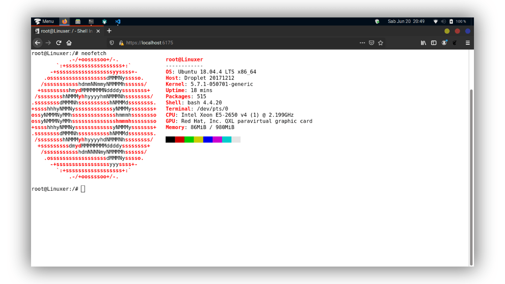
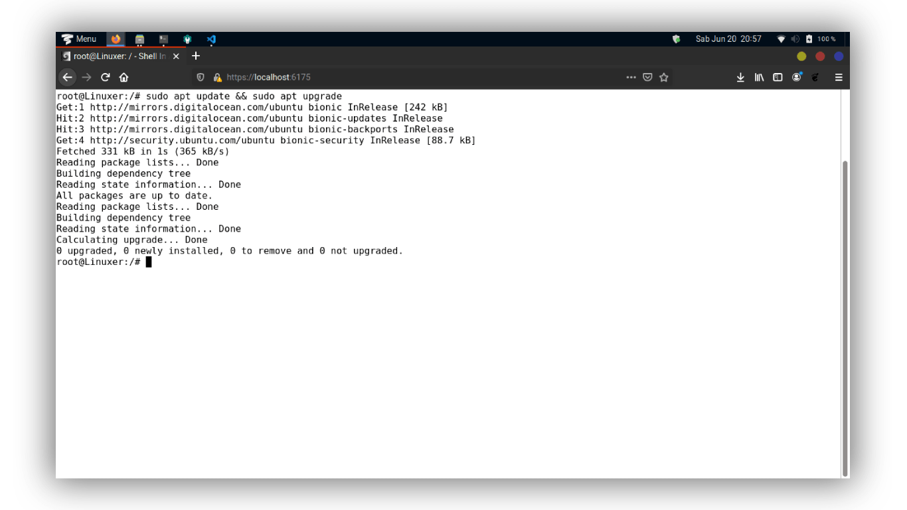
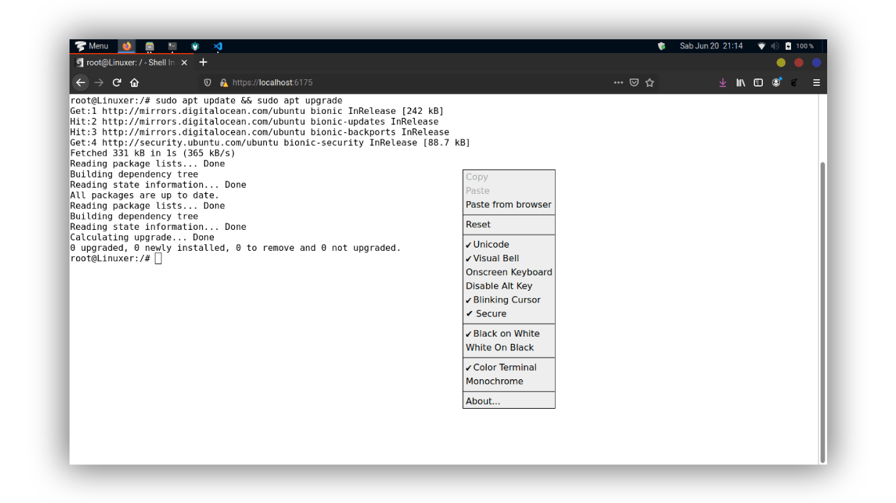

__Shell In A Box__ (diucapkan sebagai **shellinabox**) adalah emulator terminal berbasis web yang dibuat oleh **Markus Gutschke**. Ini memiliki server _web built-in_ yang berjalan sebagai klien SSH berbasis web pada port yang ditentukan dan meminta Anda emulator terminal web untuk mengakses dan mengontrol Linux Server SSH Shell Anda dari jarak jauh menggunakan browser yang diaktifkan _AJAX_ / _JavaScript_ dan _CSS_ tanpa perlu plugin browser tambahan seperti _FireSSH_.

Dalam tutorial ini, saya menjelaskan cara menginstal Shellinabox dan mengakses terminal SSH jarak jauh menggunakan _browser_ web modern di mesin apa pun. SSH berbasis web sangat berguna ketika Anda dilindungi dengan _firewall_ dan hanya diizinkan lalu lintas **HTTP(s)** yang bisa melewatinya.

## Menginstal Shellinabox di Linux

Secara _default_, alat _Shellinabox_ disertakan pada banyak distribusi Linux melalui repositori _default_, termasuk **Debian**, **Ubuntu** dan **Linux Mint**.

Pastikan repositori Anda diaktifkan dan tersedia untuk menginstal _Shellinabox_ dari repositori itu. Untuk memeriksanya, lakukan pencarian _Shellinabox_ dengan perintah `apt-cache` dan kemudian instal menggunakan perintah `apt-get`.

### Di Debian, Ubuntu dan Linux Mint

```bash
sudo apt-cache search shellinabox
sudo apt-get install openssl shellinabox
```

### Di RHEL, CentOS dan Fedora

Pada distribusi berbasis **Red Hat**, Anda harus terlebih dahulu <ins>[mengaktifkan repositori _EPEL_](/cara-install-dan-mengaktifkan-epel-repository-di-centos-8-7-6)</ins> dan kemudian menginstalnya menggunakan perintah berikut `yum`. (Pengguna **Fedora** tidak perlu mengaktifkan _EPEL_, itu sudah menjadi bagian dari proyek **Fedora**).

```bash
yum install openssl shellinabox
```

## Mengkonfigurasi Shellinabox

Secara _default_, _shellinaboxd_ berjalan pada port `TCP 4200`. Demi alasan keamanan, saya mengubah port _default_ ini menjadi acak (mis. `6175`) untuk mempersulit siapa pun untuk mencapai kotak SSH Anda. Juga, selama instalasi, sertifikat SSL yang ditandatangani sendiri secara otomatis dibuat di bawah `/var/lib/shellinabox` untuk menggunakan protokol _HTTPS_.

### Di Debian, Ubuntu dan Linux Mint

```bash
sudo nano /etc/default/shellinabox
```

```terminal
# Port TCP server web shellinboxd
SHELLINABOX_PORT=6175

# tentukan alamat IP dari server SSH tujuan
SHELLINABOX_ARGS="--o-beep -s /:SSH:<ganti dengan ip localhost/server>"

# jika Anda ingin membatasi akses ke shellinaboxd hanya dari localhost
SHELLINABOX_ARGS="--o-beep -s /:SSH:<ganti dengan ip localhost/server> --localhost-only"
```

### Di RHEL, CentOS dan Fedora

```bash
sudo nano /etc/sysconfig/shellinaboxd
```

```terminal
# Port TCP server web shellinboxd
PORT=6175

# tentukan alamat IP dari server SSH tujuan
OPTS="-s /:SSH:<ganti dengan ip localhost/server>"

# jika Anda ingin membatasi akses ke shellinaboxd hanya dari localhost
OPTS="-s /:SSH:<ganti dengan ip localhost/server> --localhost-only"
```

## Mulai Shellinabox

Setelah selesai dengan konfigurasi, Anda dapat memulai layanan dengan menjalankan perintah berikut.

### Di Debian, Ubuntu dan Linux Mint

```bash
sudo service shellinaboxd start
```

### Di RHEL dan CentOS

```bash
service shellinaboxd start
```

### Di Fedora

```bash
systemctl enable shellinaboxd.service
systemctl start shellinaboxd.service
```

## Verifikasi Shellinabox

Sekarang mari kita verifikasi apakah **Shellinabox** berjalan pada `port 6175` menggunakan perintah `netstat`.

```bash
sudo netstat -nap | grep shellinabox
atau
netstat -nap | grep shellinabox
```

Output:

```terminal
root@Linuxer:~# netstat -nap | grep shellinabox
tcp        0      0 0.0.0.0:6175            0.0.0.0:*               LISTEN      
```

Sekarang buka browser web Anda, dan arahkan ke `https://ipserver:6175`. Anda harus dapat melihat terminal SSH berbasis web. Login menggunakan _username_ dan kata sandi Anda dan Anda akan melihat _prompt shell_.





Anda dapat mengklik kanan untuk menggunakan beberapa fitur dan pilihan, termasuk mengubah tampilan dan nuansa shell Anda.



Pastikan Anda mengamankan shellinabox di firewall dan buka `port 6175` untuk Alamat IP tertentu untuk mengakses _shell_ Linux Anda dari jarak jauh.

## Troubleshoot

```terminal
command-line line 0: Unsupported option "rhostsrsaauthentication"
command-line line 0: Unsupported option "rsaauthentication"
```

Setup konfigurasi `shellinabox/service.c` menjadi seperti ini:

<div class="filename">service.c</div>

```bash
-oRhostsRSAAuthentication=no
-oRSAAuthentication=no
```

## Referensi

- [Shell In a Box](https://code.google.com/p/shellinabox/)